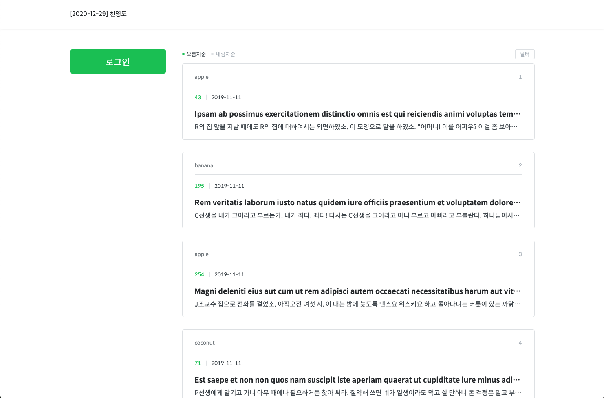
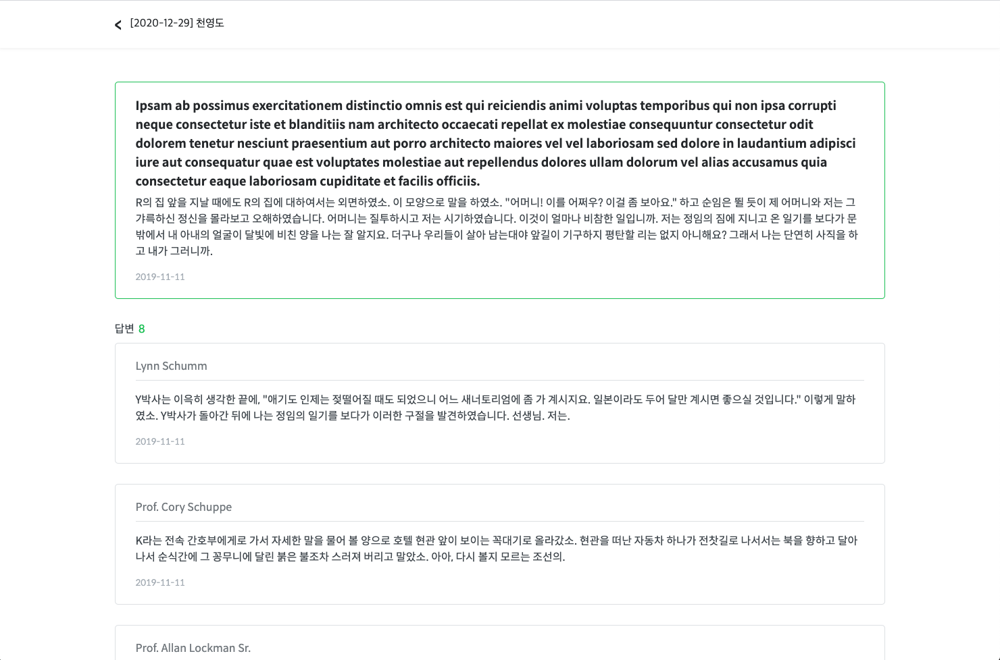
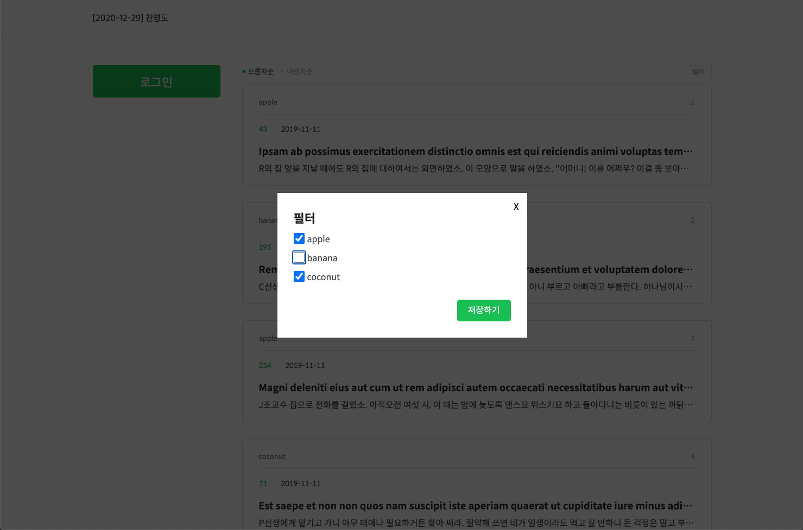
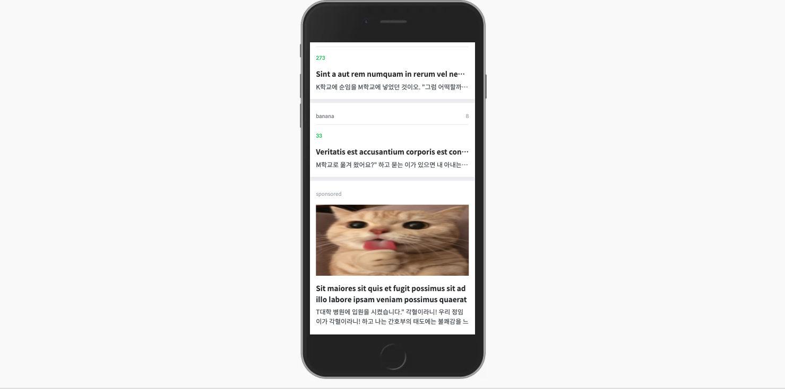
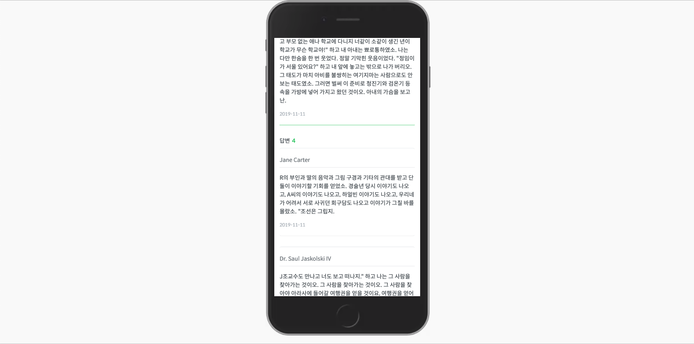

# 코멘토 피드 시스템
코멘토의 피드 시스템 과제 수행: 2020.12.22 ~ 2020.12.29

## 주요 기능
* 📱 반응형 웹: PC와 모바일/타블렛(768px이하) 각각에 맞는 레이아웃을 지원합니다.
* 🎰 무한 스크롤: 스크롤을 통해 추가적인 피드를 불러옵니다.
* 🚃 정렬 기능: 오름차 순 또는 내림차 순으로 정렬할 수 있습니다.
* ⚙️ 필터: 필터링을 통해 원하는 카테고리의 피드만 볼 수 있습니다.
* 🤖 광고 삽입: n번째 게시글 마다 광고를 삽입합니다.
* 📄 상세 페이지: 카드를 클릭하면 상세 페이지로 이동합니다. 페이지 이동은 프론트에서 라우팅을 처리하였습니다.

## 미리보기

